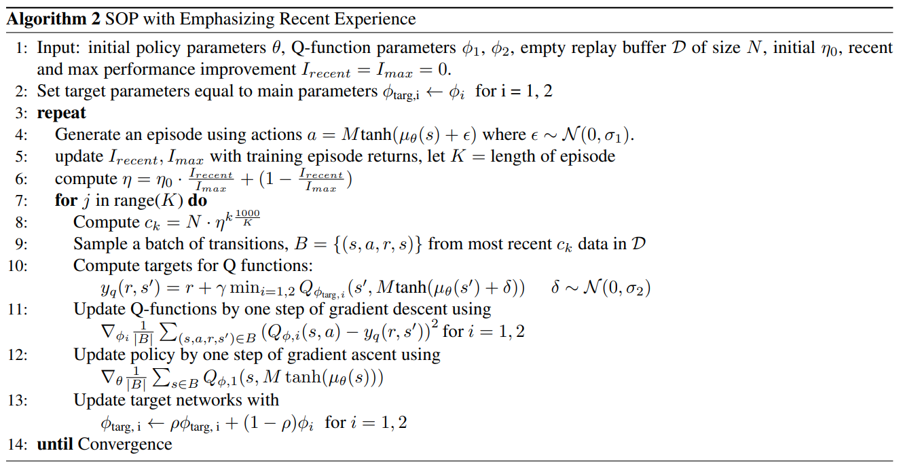

# Streamlined Off-Policy Learning

### Description
------------
Implementation of [Striving for Simplicity and Performance in Off-Policy DRL: Output Normalization and Non-Uniform Sampling](https://arxiv.org/abs/1910.02208) using the PyTorch Deep Learning Framework and PyTorch Agent Net (PTAN) Reinforcement Learning Toolkit. 
The specific algorithm implemented in this repository is the following:


### Requirements
------------
*   [mujoco-py](https://github.com/openai/mujoco-py)
*   [TensorboardX](https://github.com/lanpa/tensorboardX)
*   [PyTorch](http://pytorch.org/)
*   [PTAN](https://github.com/Shmuma/ptan)

### Usage
------------
```
usage: train_sop.py [-h] [--cuda] [--name NAME] [--env ENV]
```
All Hyperparameters can be changed in the file train_sop.py.


### Hyperparameters
------------

ENV_ID = "RoboschoolHalfCheetah-v1"       Name of the environment.
GAMMA = 0.99                              Discount factor.
BATCH_SIZE = 256                          Batch size for training.
LR_ACTOR = 0.0003                         Learning rate of the Actor/policy.
LR_CRITIC = 0.0003                        Learning rate of the Critics/Q-Networks.
REPLAY_SIZE = 1000000                     Maximum size of the replay buffer.
REPLAY_INITIAL = 10000                    Minimum size of the replay buffer to begin training.
TAU = 0.005                               Target smoothing coefficient
REWARD_STEPS = 1                          Number of rollouts for Q approximation.
STEPS_PER_EPOCH = 5000                    Number of steps an epoch has.
ETA_INIT = 0.995                          Initial eta for recent experience sampling.
ETA_FINAL = 0.999                         Final eta for recent experience sampling.
ETA_BASELINE_EPOCH = 100                  Minimum number of epochs to approximate baseline for improvement normalization with.
ETA_AVG_SIZE = 20                         Number of epochs to average performance with.
C_MIN = 5000                              Minimum number of recent samples.
FIXED_SIGMA_VALUE = 0.29                  Sigma for additive-gaussian-noise in actors action selection.
BETA = 1                                  Beta for regularization in action normalization process.
MAX_ITERATIONS = 3000000                  Maximum number of iterations.
HID_SIZE = 256                            Number of Neurons in Actors and Critics Hidden Layers.
ACTF = nn.ReLU                            Activation function used in Actor Network.


### Mentions
------------
This implementation is adapted from [Shmumas](https://github.com/Shmuma) [SAC implementation using PTAN](https://github.com/PacktPublishing/Deep-Reinforcement-Learning-Hands-On-Second-Edition/blob/sac-experiment/Chapter19/06_train_sac.py). It is also influenzed by the [official implementation](https://github.com/AutumnWu/Streamlined-Off-Policy-Learning).
